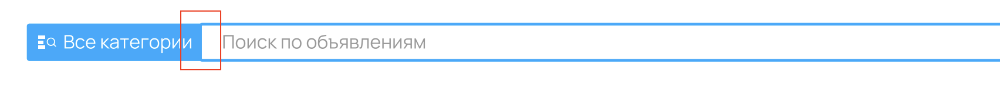
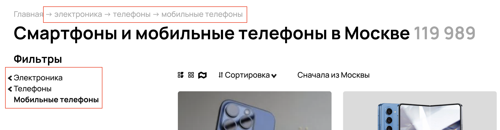
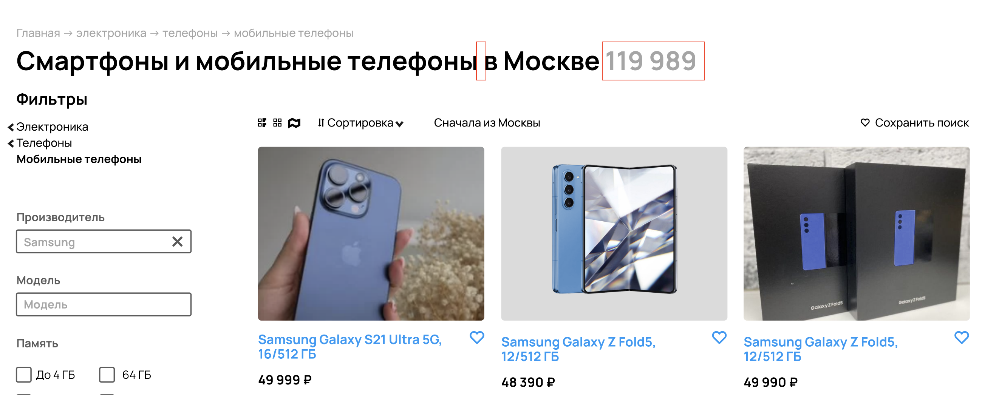
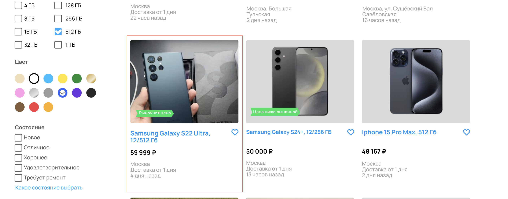
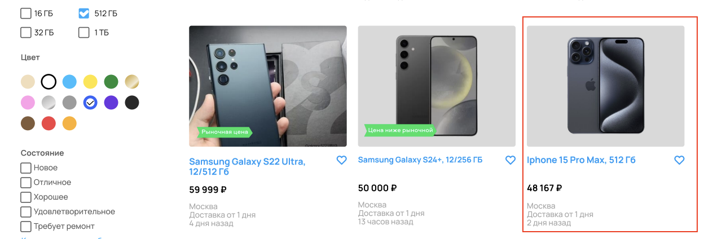
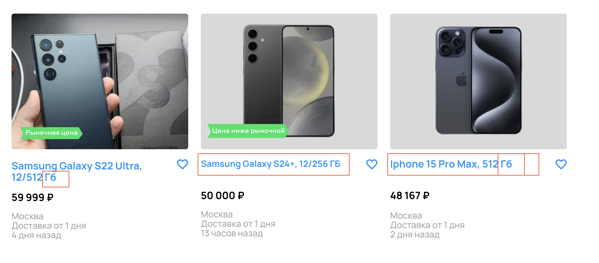

## Описание задания

Изучите скриншот,перечислите все имеющиеся баги на странице
поиска, укажите их приоритет (high, medium, low).

---

В связи с тем, что мы не можем однозначно определить, сработал ли фильтр на странице или нет, я столкнулся с неопределенностью в отслеживании возможных ошибок. Для того чтобы эффективно решить эту проблему, я принял решение исходя из вероятности применения фильтра на странице (в большем процентном соотношении результаты выборки соответсвуют примененному фильтру). Таким образом, при анализе багов я ориентировался на предположение, что фильтр скорее всего был активирован, и искал ошибки с учетом этого факта. Однако важно отметить, что для более точного определения необходимо сначала получить дополнительные данные и уточнить информацию.

## Индификатор

Баг N1

## Описание

Логотип расположенный слева от input в header выполнен с ошибкой - "A**w**ito".

## Ожидаемое поведение

Avito

## Приоритет

High

## Скриншот

---

## Индификатор

Баг N2

## Описание

Отсутсвует gap между кнопкой и input в header

## Ожидаемое поведение

gap между элементами

## Приоритет

low

## Скриншот

---

## Индификатор

Баг N3

## Описание

Отображение иконок и текста в дереве каталогов и списке котологов в фильтре, не в едином дизайне.

1.  Разные иконки указателя
2.  Написание названия католога с большой и маленькой буквы.

## Ожидаемое поведение

1.  Иконки в едином дизайне.
2.  Название католого с большой буквы.

## Приоритет

low

## Скриншот

---

## Индификатор

Баг N4

## Описание

Не отображается название каталога Производитель в дереве каталогов.

## Ожидаемое поведение

Отображение каталога **Samsung**

## Приоритет

medium

## Скриншот

---

## Индификатор

Баг N5

## Описание

В заглавном тексте не отображается выбраная марка, также некоректно отображется количество найденных телефонов по фильтру.

## Ожидаемое поведение

В тексте указана марка выбраного устройства в фильтре, указывается корректное число найденных устройств.

## Приоритет

medium

## Скриншот

---

## Индификатор

Баг N6

## Описание

Иконка вида отображения карточек товара неактивна.

## Ожидаемое поведение

Иконка активна. 

## Приоритет

medium

## Скриншот

## 

---

## Индификатор

Баг N7

## Описание

Отсутвует радиокнопка справа от фильтра _Сначала из Москвы_

## Ожидаемое поведение

радиокнопка 

## Приоритет

medium

## Скриншот

---

## Индификатор

Баг N8

## Описание

Отсутвует пагинация страниц выдачи карточек товара, сейчас отображается только 12 карточек из 77.

## Ожидаемое поведение

Пагинцация страниц для отображения всех найденных устройств.

## Приоритет

high

## Скриншот

---

## Индификатор

Баг N9

## Описание

Отображение товара который не проходит фильтр по цене _до 50000_.

## Ожидаемое поведение

Товар не отображается в выбраном фильтре.

## Приоритет

high

## Скриншот

---

## Индификатор

Баг N10

## Описание

Отображение товара который не проходит фильтр по марке _Samsung_.

## Ожидаемое поведение

Товар не отображается в выбраном фильтре.

## Приоритет

high

## Скриншот

---

## Индификатор

Баг N11

## Описание

Отображение товара который не проходит фильтр по памяти _512Гб_.

## Ожидаемое поведение

Товар не отображается в выбраном фильтре.

## Приоритет

high

## Скриншот

---

## Индификатор

Баг N12

## Описание

Отображение товара который не проходит фильтр по цвету _Синий_.
Проверить даже если есть вероятность ошибки со стороны пользователя.

## Ожидаемое поведение

Товар не отображается в выбраном фильтре.

## Приоритет

high

## Скриншот

---

## Индификатор

Баг N13

## Описание

Текст в input фильтра Производитель, вводит в заблуждение серым(неактивным) шрифтом.

## Ожидаемое поведение

черный (активный) шрифт.

## Приоритет

medium

## Скриншот

---

## Индификатор

Баг N14

## Описание

Отображение товара который не проходит фильтр по местоположения _Москва_.

## Ожидаемое поведение

Не отображать в выборке

## Приоритет

medium

## Скриншот

---

## Индификатор

Баг N15

## Описание

Размер шрифта меньше чем на других заголовках карточек товара. Также некорректно указана память _Гб_.

## Ожидаемое поведение

Шрифт в общем стиле. 
Память в ГБ.

## Приоритет

low

## Скриншот

---

## Индификатор

Баг N16

## Описание

Текст кнопки _Найти_ не по центру. Также поле input выше по высоте.

## Ожидаемое поведение

В соответсвии с дизайном

## Приоритет

low

## Скриншот

---

## Индификатор

Баг N17

## Описание

Карточки товара имеют парметр _Оперативной памяти_. Но фильтрах отсутвует такой параметр.

## Ожидаемое поведение

Параметр _Объем оперативной памяти_ в фильтрах.

## Приоритет

high

---
